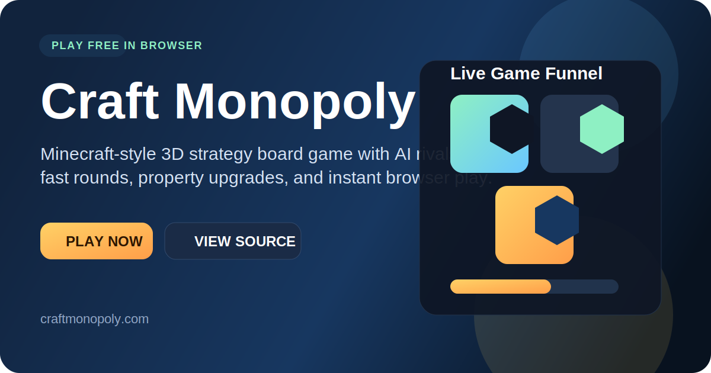

# Craft Monopoly

[](https://craftmonopoly.com)
[](https://github.com/zhanjianping88/craftmonopoly)



Craft Monopoly is a free browser game with Minecraft-inspired 3D visuals and Monopoly-style strategy gameplay. Players can buy properties, upgrade districts, pay rent, trigger chance cards, and compete against human or AI opponents directly in the browser.

## Play Online

Play the live site here:

- [craftmonopoly.com](https://craftmonopoly.com)

## Why this repository matters

- The repository doubles as the source code for the live site
- Visitors can click straight from GitHub to the playable game
- The project is set up for simple ongoing shipping through GitHub and Vercel

## Game features

- Free browser-based gameplay
- Minecraft-style 3D board and character skins
- 2 to 10 players
- Human and AI player support
- Property buying, rent, upgrades, chance cards, tax, and jail mechanics

## Project links

- Live site: [https://craftmonopoly.com](https://craftmonopoly.com)
- GitHub repo: [zhanjianping88/craftmonopoly](https://github.com/zhanjianping88/craftmonopoly)
- Feedback and bug reports: [GitHub Issues](https://github.com/zhanjianping88/craftmonopoly/issues)

## Local development

Run the project locally:

```bash
python3 -m http.server 4173 --directory .
```

Then open:

- `http://localhost:4173`

## Monetization-ready direction

- The landing page is structured for SEO and paid traffic funnels
- The homepage includes reserved placement for sponsor or ad units
- The repository page now acts as an additional discovery surface for the game
