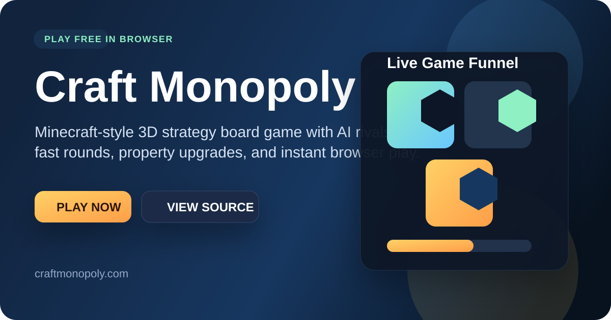

# Craft Monopoly

[](https://craftmonopoly.com)
[](https://github.com/zhanjianping88/craftmonopoly)



Craft Monopoly is a local property game with Minecraft-inspired 3D visuals. Roll across a 28-space board, claim plots, control a biome, upgrade buildings, collect rent, and survive random events against friends or AI. The World Storm adds escalating upkeep, and the last solvent player wins.

## Play Online

Play the live site here:

- [craftmonopoly.com](https://craftmonopoly.com)

## Why this repository matters

- The repository doubles as the source code for the live site
- Visitors can click straight from GitHub to the playable game
- The project is set up for simple ongoing shipping through GitHub and Vercel

## Game features

- Free browser-based gameplay
- Minecraft-style 3D board and character skins
- 2 to 10 local players in pass-and-play or AI combinations
- A player-count-tuned setup window followed by escalating World Storm upkeep
- Two-of-three biome control, property upgrades, rent attacks, and last-player-standing victory
- Property buying, building upgrades, biome monopolies, rent, random event cards, tax, and missed turns
- Responsive game UI with character selection and voxel-style Three.js board

## Project links

- Live site: [https://craftmonopoly.com](https://craftmonopoly.com)
- GitHub repo: [zhanjianping88/craftmonopoly](https://github.com/zhanjianping88/craftmonopoly)
- Feedback and bug reports: [GitHub Issues](https://github.com/zhanjianping88/craftmonopoly/issues)

## Local development

Run the project locally from this directory:

```bash
python3 -m http.server 4173 --directory .
```

Then open:

- `http://localhost:4173`

The game is a static browser app. Three.js is loaded from jsDelivr, so the first page load needs an internet connection.
